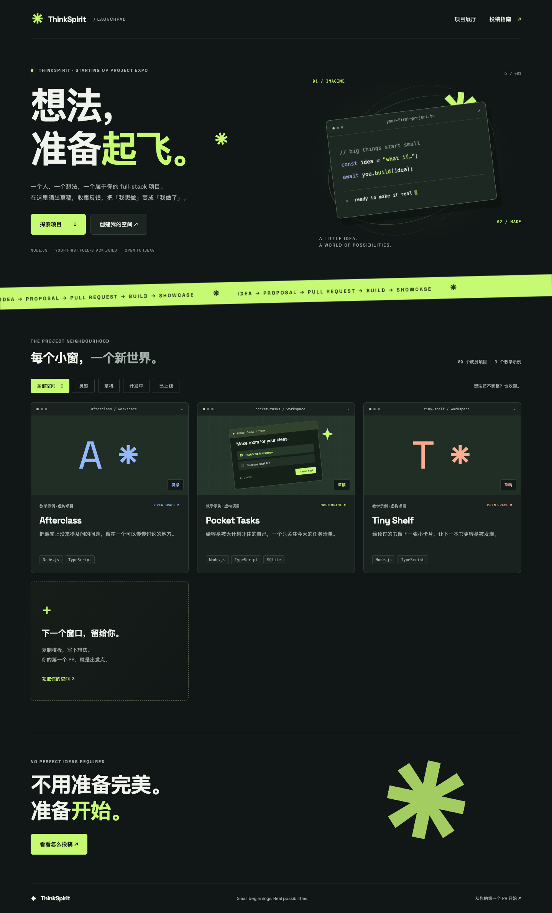

# ThinkSpirit Launchpad ✳

ThinkSpirit 新人的 Starting Up Project Expo。展示 Node full-stack 个人项目的想法、草稿与进度。纯静态站点，无自建数据库、账号系统或运行时服务器。项目评论通过 Giscus 使用 GitHub 登录。

- Astro 7 + TypeScript，构建时生成独立页面。
- 每人一个 `src/content/spaces/<name>/` 文件夹，Markdown 和图片放在一起。
- 内容集合校验卡片字段，首页自动收录，不需要手动维护名单。
- 项目阶段筛选、个人页面目录、响应式布局和减少动画偏好支持。
- 内置中文投稿指南、模板、创建脚本、PR 模板和三个明确标记的虚构教学示例。

## 预览



## 本地开发

使用 Node.js 24 LTS（`.node-version`）。

```sh
npm ci
npm run dev
```

打开终端显示的地址。首页是展厅，`/guide/` 是投稿指南，`/spaces/pocket-tasks/` 是完整示例。

```sh
npm run new -- your-name-project
npm test
npm run build
npm run preview
```

`npm run build` 先进行 Astro/TypeScript 检查，再输出静态文件到 `dist/`。不需要 Cloudflare adapter。

## 投稿

1. Fork 仓库并创建分支。
2. 运行 `npm run new -- your-name-project`，也可以手动复制 `templates/space/`。
3. 修改新文件夹中的 `index.md`，放入自己的草图。
4. 本地预览，运行测试和构建。
5. 只提交自己的空间文件夹，向主分支提 PR。

完整说明见站点 `/guide/`。已生成的空间名不会被脚本覆盖。

### 内容字段

必须填写 `title`、`author`、`tagline`、`stage`、`tags`、`updated`。`stage` 可用 `idea` / `draft` / `building` / `shipped`；`accent` 可用 `lime` / `blue` / `coral`。`cover` 是本地图片路径；`repo` 和 `demo` 是可选 HTTPS 链接。自己的投稿保持 `example: false`。

文件夹名即公开地址，发布后不要随意重命名。每人的 full-stack 应用应放在自己的项目仓库，这个仓库只存展示内容。

## Cloudflare Pages（由维护者配置）

- 连接此 Git 仓库，生产分支：`main`。
- 构建命令：`npm run build`。
- 输出目录：`dist`。
- 仓库根目录作为 root directory。
- 构建环境设置 `NODE_VERSION=24`。
- 如有需要，在 Pages 中启用非生产分支/PR 的 Preview deployments；以 Cloudflare 对仓库权限和 Fork 的实际支持为准。

没有配置 GitHub Actions，避免额外消耗 CI 额度。构建失败会阻止新产物发布。Pages 已连接仓库，主分支推送自动部署。

## 项目评论

每个项目详情页底部嵌入 Giscus，使用 GitHub 登录评论。评论保存在本仓库 Discussions 的 `Announcements` 分类，按 `pathname` 严格匹配，各项目独立讨论。更换站点域名不会改变映射；更改项目文件夹名会改变评论关联路径。

配置位于 `src/components/Comments.astro`，仓库 ID 和分类 ID 是公开标识，不是密钥。不需要 Cloudflare 环境变量或额外 npm 依赖。维护者需要保持 Discussions 开启，并让 Giscus GitHub App 对本仓库有访问权限。

评论 iframe 懒加载，使用中文和深色主题。浏览器需能访问 `giscus.app` 与 GitHub；加载受阻时可通过页面链接前往 Discussions。阅读项目正文不依赖评论服务。评论公开可见，请勿发布个人隐私；维护者可在 GitHub 中管理评论。

## 维护与安全

- 投稿 Markdown 是仓库代码的一部分，允许 HTML，**不是不可信内容的沙箱**。合并前审查外链、HTML、脚本及素材。个人文件夹是组织约定，不是权限隔离。
- 不要提交密钥、联系方式等隐私或未经许可的素材。不要把用户投稿做成不经审查的自动合并。
- 优先只改自己的文件夹；公共样式、依赖、脚本变更另提 PR。
- 空间名使用小写英文字母、数字和单连字符，最长 48 个字符。
- 内容校验约束标题长度、标签数量、阶段值和链接格式。不要为了通过构建而关闭检查。
- 仅 UI 交互会发少量客户端 JS，内容在 JavaScript 禁用时仍可浏览。
- Space Grotesk 字体从 Google Fonts 加载；无法访问时自动使用系统字体。无分析追踪脚本。
- 首页示例用于展示布局，不冒充真实成员。可在真实成员加入后删除 `example: true` 的文件夹。

## 目录

```text
src/content/spaces/    # 成员空间（index.md + 图片）
src/content.config.ts # 内容 schema
src/pages/            # 首页、指南、个人页、404
src/styles/           # 共享视觉样式
templates/space/      # 新空间模板，不会出现在展厅
scripts/              # 创建空间脚本
tests/                # 脚本回归测试
```
