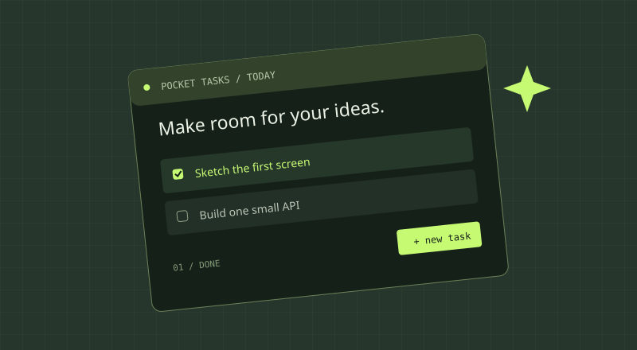

## 我想解决什么问题

有时任务管理工具本身比任务还复杂。我想给正在学编程的自己做一个简单的「今天要做什么」页面，打开就能写，完成就能勾选。

这是一个 **proposal 示例**。下面的功能和技术设计还没有实现。

## 首版只做这些

- 新增一条任务，标题不能为空。
- 展示任务列表，区分未完成和已完成。
- 勾选完成或撤销完成。
- 删除任务，刷新后数据仍然存在。

**暂不做：** 提醒、多人协作、标签系统、AI 拆解任务。首版按本机单用户设计。如果要部署给多人使用，需要另行设计登录和数据隔离，不能直接把这个单用户接口公开。

## 一条完整的使用路径

1. 用户在输入框写「画出首页」，点击添加。
2. 前端向 `POST /api/tasks` 发送标题。
3. Node 后端验证输入，把任务写入 SQLite。
4. 后端返回新任务，前端将它加入列表。
5. 刷新页面，前端通过 `GET /api/tasks` 取回已保存的任务。

这一条路径跑通，就是我的第一个 full-stack 里程碑。

## 技术与数据

- 前端：Vite + TypeScript，先用原生 DOM，减少同时学习的概念。
- 后端：Node.js + Fastify，提供 JSON API。
- 数据库：SQLite，适合先在本机做单用户实验。
- 验证：后端校验标题长度，出错返回明确的信息。

```ts
interface Task {
  id: string;
  title: string;
  completed: boolean;
  createdAt: string;
}
```

| 请求 | 用途 |
| --- | --- |
| `GET /api/tasks` | 读取列表 |
| `POST /api/tasks` | 创建任务 |
| `PATCH /api/tasks/:id` | 修改完成状态 |
| `DELETE /api/tasks/:id` | 删除任务 |

## 草图



首页只需要标题、输入框和任务列表。上图是示意稿，视觉可以在功能跑通后再打磨。

## 下一步与想问的问题

- [x] 写清使用场景和首版范围。
- [x] 画第一版页面草图。
- [ ] 写一个能返回任务列表的 API。
- [ ] 接上数据库并验证刷新后任务仍在。
- [ ] 让前端完成新增、勾选和删除。

我希望大家帮我看看：**作为第一周的范围，这四个功能是不是太多？数据库操作应该怎样拆开练习？**
