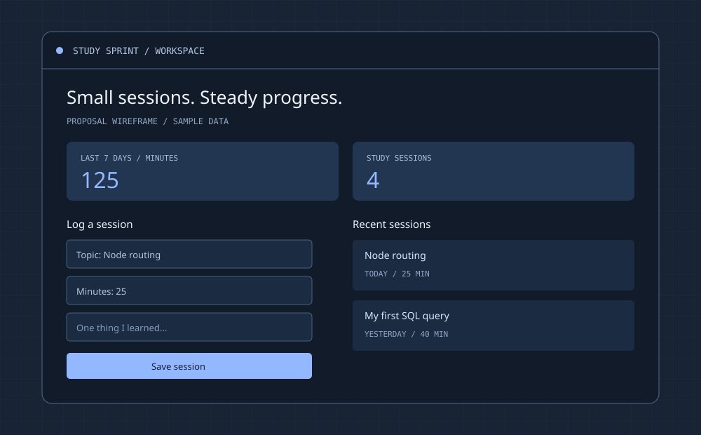

## 我想解决什么问题

学 Node 全栈时，我经常觉得「今天忙了很久」，却说不清具体学了什么。我想做一个简单的学习记录工具：每完成一次学习，记下主题、分钟数和一句收获，周末就能回看。

目标用户是正在学习编程、想看见自己进度的个人。

> 这是用来演示完整投稿 PR 的虚构项目，目前只有 proposal 和界面草图。以下功能尚未实现，不代表真实成员的作品。

## 首版只做这些

- 新增学习记录：主题、学习分钟数和可选笔记。
- 展示最近的记录，可以删除输错的条目。
- 汇总最近 7 个自然日的学习分钟数和记录次数。
- 关闭再打开页面，记录仍然保存在数据库里。

**暂不做：** 实时计时器、登录、排行榜、AI 分析、多人共享。先做本机单用户版本，不将没有身份验证的写接口公开到互联网。

## 一条完整的使用路径

1. 我学完一节「Node 路由」，打开页面。
2. 填写主题、`25` 分钟和「终于理解了请求与响应」。
3. 前端向 `POST /api/sessions` 发送 JSON。
4. 后端验证输入，把记录和创建时间写进 SQLite。
5. 前端显示新条目，并重新获取七日汇总。
6. 刷新页面，通过 `GET /api/sessions` 取回记录。

第一步先实现新增和刷新后读取。汇总等这条路径跑通后再做。

## 技术与数据

- **前端：** Vite + TypeScript，先用原生 DOM 和 `fetch`，练习表单、异步请求和错误提示。
- **后端：** Node.js + Fastify，提供 JSON API。开发时由 Vite 代理 `/api`，避免初学阶段同时处理跨域配置。
- **数据库：** SQLite，本地文件持久化，SQL 使用参数绑定。
- **输入检查：** 主题去掉首尾空格后为 1–80 个字符，分钟数为 1–480 的整数，笔记不超过 500 个字符。这些是首版的产品范围选择。
- **日期：** `createdAt` 用 UTC 时间保存；七日汇总先固定为 `Asia/Shanghai`，按今天及前六个自然日计算，而不是滚动 168 小时。日期边界由后端统一处理。

```ts
interface StudySession {
  id: string;
  topic: string;
  minutes: number;
  note: string;
  createdAt: string;
}
```

| 请求 | 用途 |
| --- | --- |
| `POST /api/sessions` | 验证输入并创建一条记录 |
| `GET /api/sessions` | 读取记录，按创建时间倒序排列 |
| `DELETE /api/sessions/:id` | 删除一条记录，不存在时返回 404 |
| `GET /api/summary` | 返回七日分钟数与记录次数 |

没有记录时返回空列表和零汇总。请求失败时保留表单内容并显示错误；发送中禁用提交按钮，减少重复提交。

## 草图



上方用两个数字显示一周概况。左边新增记录，右边回看最近学习内容。图中的数字和条目都是示意数据。

## 怎么判断第一版做完了

- 新增一条记录，刷新页面后仍能看到它。
- 删除记录后，列表与七日汇总同步更新。
- 空白主题、负数和小数分钟会被后端拒绝，前端展示可理解的错误。
- 今天与七天前的记录对七日汇总产生正确的影响。
- 第一次打开时有明确的空状态，而不是报错。

## 下一步与想问的问题

- [x] 写出用户场景与首版范围。
- [x] 画出首页草图。
- [ ] 建立 Node 服务，先用临时数组跑通新增和读取。
- [ ] 将数据换成 SQLite，验证重启后记录仍在。
- [ ] 接入前端表单和列表。
- [ ] 完成删除、七日汇总和输入校验。

我希望大家帮我看看：

1. 对第一次做 full-stack 的新人来说，七日汇总是否应该推迟到第二版？
2. 暂时不用前端框架，是否更容易看清浏览器到后端的完整过程？
3. 完成单用户版本后，学习身份验证和数据隔离应该怎么拆步骤？
