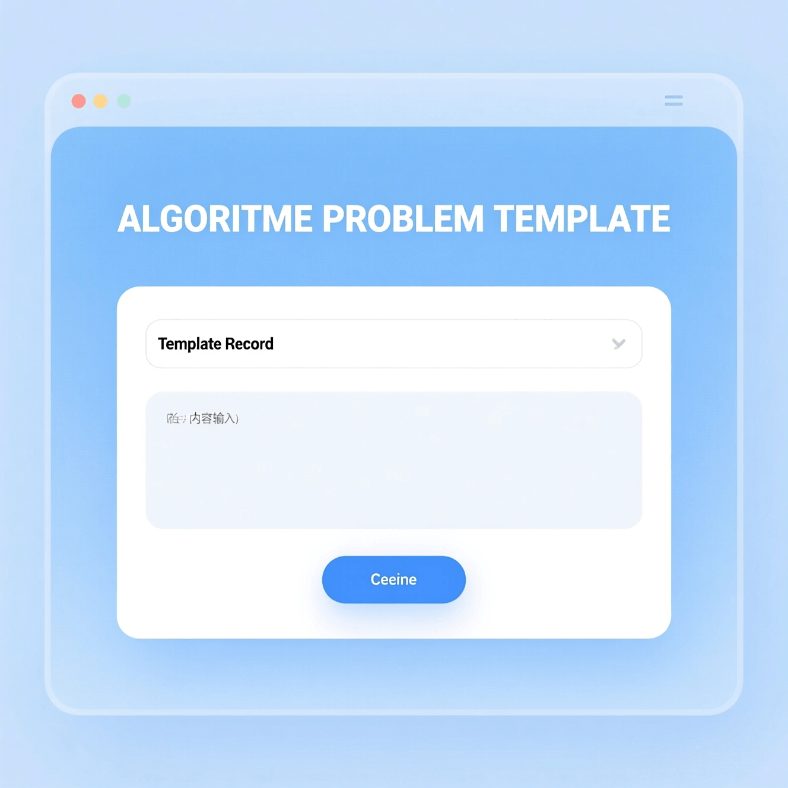

## 我想解决什么问题

现在算法选手的题目是越做越多，遇到这么多的模板，我有时会烦恼应该怎么把它们归纳起来呢？所以我决定给自己创建一个模板归纳平台，随时查看，随时记录。

## 首版只做这些

- 一个简洁的 UI 界面
- 新增一个模板记录，标题不能为空
- 能够删减、合并模板记录
- 暂不做：多人使用

## 一条完整的使用路径

1. 用户打开页面 → 前端请求模板列表 → 页面渲染成卡片。
2. 用户输入标题和内容 → 点保存 → 前端校验标题非空 → 提交给后端 → 后端存库 → 页面把新记录插到列表顶部。
3. 删除 / 合并：勾选记录 → 调用对应接口 → 后端处理 → 页面更新列表。

（接口名和数据格式还没定，见下节。）

## 技术与数据

- 前端：待决定。
- 后端：Node.js，框架待决定。
- 数据库：待决定。
- 核心字段：待决定（暂定 id、title、content、created_at）。

## 草图

## 下一步与想问的问题

- [ ] 确定开发需要的技术与数据
- [ ] 确定首版范围。
- [ ] 画出主要页面。
- [ ] 跑通一个 API。

我希望大家帮我看看：我是新手，前面有些是AI做的，后续我应该学习哪些技术